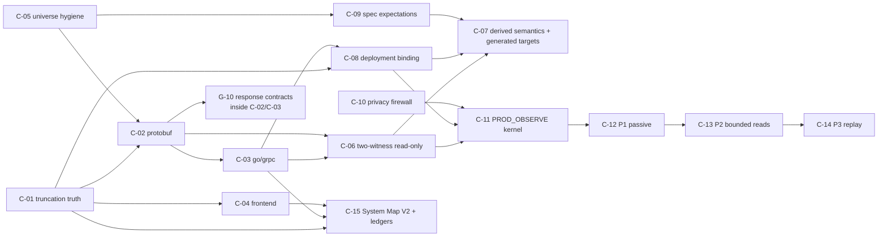

# MASTER PLAN — Nightwatch Production Observability & Whole-System Map

Canonical implementation roadmap. **Nothing in this document is authorized.**
Every campaign requires its own explicit, one-shot owner authorization before a
future session may begin it.

Companion documents live in `openspec/changes/nightwatch-production-observability-system-map-master-plan-v1/`:
`audit.md` (evidence baseline), `design.md` (target architecture),
`tasks.md` (campaign checklist) and `specs/` (requirement deltas).
Hazards are in `docs/design/PRODUCTION-OBSERVABILITY-THREAT-MODEL.md`.

Baseline: audit measured from Nightwatch `HEAD 784d553` on 2026-09-01. Local
`main` advanced to `54df439` during the session through a concurrent
predecessor-task closure (documentation/continuity commits authored by that
session, not by this planning campaign).

---

## 0. Executive answer

Nightwatch's safety architecture is finished and excellent. Its *reach* is 4 %
of the repositories, 57 % of the one repository it actually parses, and 2 % of
the read-only proof it needs. It has never produced a product finding, and the
reason is arithmetic, not machinery: **3 eligible surfaces, 3 journeys, one
environment.**

The plan therefore front-loads **reach and proof**, defers **production**
behind them, and treats the Control Center and coverage work as the way the
operator can *see* that reach growing. Production observation is designed as a
separate program with an eleven-gate admission chain and a five-stage promotion
ladder, and it is not entered until the read-only proof it depends on exists.

Three numbers define success:

| Metric | Today | After C-01…C-05 (target) | After C-06…C-09 (target) |
|---|---|---|---|
| operations modelled | 128 (capped, 1 repo) | ≥ 900 (≥ 5 repos, uncapped) | same |
| `READ_ONLY_PROVEN` | 5 (hand-catalog) | ≥ 200 (two-witness, mechanical) | same |
| product findings | 0 | ≥ 1 on DEV | ≥ 1 from P2 production reads |

---

## 1. Gap matrix

Effort is relative (S ≈ one focused campaign, M ≈ two, L ≈ three+).
"Blocks" columns: **P** production observation · **M** whole-system mapping ·
**A** autonomous bug hunting.

| # | Gap | Current | Target | Evidence | Risk | Depends | Recommended implementation | Alternatives considered | Safety implication | Test strategy | Acceptance | Effort | P | M | A |
|---|---|---|---|---|---|---|---|---|---|---|---|---|---|---|---|
| G-01 | Operation discovery silently truncated | `MAX_DISCOVERED_OPERATIONS = 128`; 95 of 223 dropped; counter unreported | no silent loss; `TRUNCATED` first-class everywhere | `surfaces.ts:59,818,836,875`; live census; 223 route keys | false completeness in every downstream number | — | page the discovery; surface `routeOperationsTruncated` in CLI, contract, ledger; make exceeding a hard bound an error | raise the cap (rejected: same failure at a bigger N) | none — strictly more truth | fixture with `limit+1` routes asserts `truncated` propagates to all three surfaces | census reports 223 operations for ripple-api, truncated 0 | S | ✔ | ✔ | ✔ |
| G-02 | Protobuf unreadable | `.proto` absent from `SOURCE_SCAN_EXTENSIONS`; `blueapi/billing` admits 0 files | 662 RPCs with HTTP verb + path extracted | `scanTypes.ts:15,18`; census `admittedFileCount: 0`; 599+63 RPC count | the largest single unread evidence source | — | add `PROTOBUF` language + `.proto` extension; bounded lexer for `service`/`rpc`/`option (google.api.http)`; emit route, verb, request/response message | full protobuf parser (rejected: unnecessary — the grammar needed is fixed and tiny) | read-only source expansion inside an already-approved repo | positive corpus from `billing.proto`; negative corpus of malformed/nested/streaming options | ≥ 147 operations from `blueapi/billing`, each with verb + path + message types | S | ✔ | ✔ | ✔ |
| G-03 | No mechanical read-only proof | `PHASE5_API_CATALOG` 11 rows; 5 of 128 proven | two-witness `READ_ONLY_PROVEN` | `surfaces.ts:149-162`; `catalog.ts` | the single gate on every downstream authority | G-02 | witness classes `W-DECLARED_VERB`, `W-DECLARED_ROUTE`, `W-EFFECT_CLOSURE`, `W-EFFECT_RPC`, `W-SPEC`; lattice in `design.md` §4` | runtime differential (rejected: circular + needs frozen state oracle); LLM classification (rejected: D-32) | this is the control every production gate depends on | historical false positives (D-79) as a permanent negative corpus; vocabulary-removal mutation test | ≥ 200 operations `READ_ONLY_PROVEN` with two witnesses each | L | ✔ | ✔ | ✔ |
| G-04 | Empty endpoint semantic registry | `RIPPLE_ENDPOINT_SEMANTIC_REGISTRY = []` | derived from G-03, not hand-authored | `endpointSemantics.ts:28` | every observed request stays `UNKNOWN` | G-03 | generate the registry from proven classifications at campaign prepare | keep hand-authoring (rejected: does not scale past 11) | fail-closed preserved; registry is derived, digest-bound | assert a hand-edit cannot inject a rule without provenance | registry non-empty and fully provenance-bound | S | ✔ | — | ✔ |
| G-05 | Go/gRPC topology absent | 753 admitted Go files, 0 operations | proto service → ouchan service → handler set | 17 `Register*Server` sites; `SERVICES.md` 131 services | backend map is empty | G-02 | bounded lexer for `pkg.RegisterXServer(gs, svc)` + `UnimplementedXServer` embedding; join to proto by service symbol | Go AST via `go/parser` (rejected for v1: needs a Go toolchain in the analyzer cone; revisit if the lexer proves insufficient) | read-only | positive corpus of the 17 real sites; negatives for aliased imports and dynamic registration | ≥ 12 services bound to ≥ 12 proto services | M | — | ✔ | ✔ |
| G-06 | Frontend→backend joins absent | 0 | literal-path edges from ~150 `vuex/api` modules + alupi stores | `ripple-ui/src/vuex/api/*.js`; `axios.config.js` | blast radius unknown; no UI→API path | G-01 | `@vue/compiler-sfc` + JS AST for Vue 2; TS compiler API for MFEs; extract `<instance>.<verb>(<literal|template>)`; join by canonical path | regex over sources (rejected: 22 % template literals need real parsing) | read-only | corpus of literal, template, and dynamic call sites; dynamic ⇒ `INFERENCE`, never `SOURCE_FACT` | ≥ 400 frontend→route edges, each classed | M | — | ✔ | ✔ |
| G-07 | Repository universe hand-written and drifting | two literals; baked `dirty`/`ahead`/`behind` already false for `ouchan` | discovered universe + owner-approved admission list; git metadata read live | `map.ts:10-95`; `approvedScan.ts:11-16`; live `git status` | stale authority; scaling ceiling | — | discovery pass over the sibling root producing candidate repositories; a single owner-approved allowlist; **never** persist mutable git state in source | keep literals (rejected: B-4 already materialized) | admission remains explicitly owner-gated; discovery grants nothing | assert a discovered-but-unapproved repo is never scanned | one allowlist; zero persisted git mutable state | S | — | ✔ | ✔ |
| G-08 | Route → runtime host unproven | 5 bindings, all from the 11-row catalog | `DEPLOYMENT_FACT` where derivable; `UNKNOWN` otherwise | CI trigger configs; `common.js` host matrix; U-1 | cannot target production without knowing what serves a route | G-01 | extract repo → `ouchan/services/<n>` from CI configs; extract env → host from `common.js`; leave the Ingress hop `UNKNOWN` | infer from URL prefixes (rejected: inference cannot grant authority, I-3) | prevents targeting the wrong service | assert `UNKNOWN` is never upgraded silently | every operation carries a binding class; no false `PROVEN` | M | ✔ | ✔ | — |
| G-09 | Independent expectation corpus unused | 0 of ≈350 `Requirement:` / ≈823 `Scenario:` | admitted second-witness expectation family | `ripple-openspec` 213/484; `ouchan/openspec` 131/329 | leaves the only human-authored behavioural truth unread | G-01 | bounded Markdown structure parser (`### Requirement:` / `#### Scenario:` / `**WHEN**` / `**THEN**`); classify each scenario `CHECKABLE_BY_READ_OBSERVATION` vs not; admit only the checkable subset | treat specs as prose for an LLM (rejected: D-32) | expectations are declarative and provenance-bound exactly like recipes | classification corpus with expected verdicts; assert non-checkable scenarios grant nothing | ≥ 40 admitted spec-derived expectations | M | — | — | ✔ |
| G-10 | Response contracts thin | 43 of 128; response flow 13 attempted / 0 proven | proto message types give exact schemas for 662 RPCs | census; `responseFlow.ts` | oracles have nothing to assert on most surfaces | G-02 | derive response contracts from proto message definitions; keep the PHP flow analyzer for the legacy surface | widen the PHP analyzer further (rejected: D-78/D-79/D-82 showed diminishing returns and repeated false positives) | none | proto→contract corpus; drift test against generated Go structs | ≥ 400 response contracts proven | M | — | ✔ | ✔ |
| G-11 | Privacy model is a denylist | `RedactionLayer` + sentinel screening | allowlist structural projection behind a boundary | D-6; `privateScreening.ts` | production customer data is ordinary-looking; a denylist cannot enumerate it | — | projection layer per `design.md` §6`; hardening rule isolating the cone; separate production store root | extend the denylist (rejected: unbounded value space) | this is the control that makes production observation acceptable at all | five tests in `design.md` §6.5` | all five green; persistence audit clean | M | ✔ | — | — |
| G-12 | No production mode | `SUPPORTED_ENVIRONMENTS` excludes production by construction | `PROD_OBSERVE` separate authorization class, config, policy, launcher | D-4; `realRunGate.ts:128-131` | the whole objective | G-03, G-08, G-11 | `design.md` §5`; eleven-gate chain; five-stage ladder | add a fourth environment (rejected — destroys D-4's unloadable-file property) | maximal; every control in `docs/design/PRODUCTION-OBSERVABILITY-THREAT-MODEL.md` attaches here | mock-production qualification exercising all eleven gates at 100 % denial for non-admitted cases | PQ receipt green; zero real contact | L | ✔ | — | ✔ |
| G-13 | Control Center cannot show the system | 24-node SVG grid vs 1000-node contract; no zoom/search/filter; truncation invisible | System Map V2 with progressive disclosure and explicit evidence status | `App.tsx`; `sourceGraph.ts` | operator cannot audit reach or see truncation | G-01, G-05, G-06 | ELK.js deterministic layout + canvas renderer; four zoom levels as distinct bounded projections; `TRUNCATED` as a rendered state | extend handcrafted SVG (rejected: does not scale, no hit-testing); D3-force (rejected: non-deterministic) | UI stays GET/HEAD-only; no execution affordance | deterministic-layout snapshot test; 10⁴-node render budget test | operator can answer all eight queries in `design.md` §7.5` | L | — | ✔ | — |
| G-14 | Coverage reported as prose | narrative counts in six documents, some stale | two machine-checked ledgers with five buckets per dimension | `audit.md` §A.12`, `§C` | no truthful answer to "how much do we understand?" | G-01 | `design.md` §8`; ledgers are generated, never hand-written | single percentage (explicitly prohibited by the objective) | none | assert `UNMEASURED ≠ 0 %`; assert `truncated>0` invalidates completeness | both ledgers emitted by CLI and Control Center | S | — | ✔ | ✔ |
| G-15 | Yield loop starved and unprioritized | 3 journeys; no EIG scoring; change intelligence orphaned | generated journeys over proven surfaces + EIG prioritization | `products/ripple/journeys.ts`; A.10 item 4 | zero findings | G-03, G-04, G-10 | generate journeys/operations from `READ_ONLY_PROVEN` + runtime-bound surfaces; wire `selectJourneys` into the portfolio scorer | keep hand-authoring (rejected: 3 journeys is the measured ceiling) | every generated target still passes the full admission chain | assert a generated journey with a single-witness surface is refused | ≥ 30 generated DEV targets; ≥ 1 product finding | L | — | — | ✔ |
| G-16 | Stale duplicate figures in durable docs | "83 / 175 / 45-80-3" reads as current | one derived figure source | `audit.md` §A.12` | future agents will use wrong numbers | G-14 | make the census the only writer of these figures; retire superseded narratives | manual correction (rejected: recurs) | none | assert no document contains a census figure absent from the current ledger | doc/ledger equality check in the gate | S | — | ✔ | — |

---

## 2. Campaign programme

Fifteen campaigns. Each is independently certifiable and independently
authorizable.

### Track A — Reach (source intelligence)

#### C-01 · Truncation truth and discovery paging
- **Objective.** Eliminate silent operation loss and make `TRUNCATED` a
  first-class, propagated state.
- **Rationale.** Every number Nightwatch reports about the system is currently
  a floor presented as a total (G-01, bug B-1).
- **Scope.** `src/core/source/surfaces.ts` discovery loop and counters;
  `surfaceTypes.ts`; `eligibilityCensus.ts`; `readonlyCandidateCensus.ts`;
  `bin/nightwatch-intelligence.mjs` projections; the Control Center
  `source-summary` contract; the coverage ledger.
- **Non-goals.** No new language, no new proof family, no analyzer change.
- **Dependencies.** none.
- **Architecture touched.** Phase 25 discovery; Phase 24 bridge counts;
  Control Center source contract.
- **Expected modules.** `source/surfaces.ts`, `source/surfaceTypes.ts`,
  `source/eligibilityCensus.ts`, `controlCenter/contracts/sourceSummary.ts`,
  `bin/nightwatch-intelligence.mjs`.
- **Safety constraints.** Local/source only. No runtime authority change. The
  Phase-24 eligibility predicate must not change; only the population it sees.
- **Deliverables.** Paged discovery; `truncated` in every projection; a
  `TRUNCATED` state in the source contract.
- **Adversarial tests.** `limit+1` fixture; a repository that exceeds the file
  cap; assert both are visible, not silent.
- **Acceptance.** `campaign:eligibility-census` reports **223** operations for
  `ripple-api` with `routeOperationsTruncated = 0`; every dimension in the
  coverage ledger carries a truncation bucket.
- **Rollback.** Pure additive counters plus a loop change; revert restores 128.
- **Newly authorized after completion.** Nothing new; reporting only.
- **Remains unauthorized.** All of it — DEV/NEXT/production unchanged.

#### C-02 · Protobuf source intelligence
- **Objective.** Read `.proto` and extract service/RPC/verb/path/message.
- **Rationale.** 662 annotated RPCs sit in already-approved repositories and
  are rejected on a file extension (G-02, bug B-2).
- **Scope.** `PROTOBUF` language + `.proto` extension; a bounded proto lexer;
  `parseProtoRoutes`; response-contract derivation from message definitions.
- **Non-goals.** No proto *compilation*, no descriptor decoding, no generated-
  code reading, no gRPC client construction.
- **Dependencies.** C-01 (otherwise the new operations are truncated away).
- **Expected modules.** `source/scanTypes.ts`, `source/protoLexer.ts` (new),
  `source/surfaces.ts` (`parseProtoRoutes`), `semanticCoverage/sourceAnalyzers.ts`.
- **Safety constraints.** Read-only; bounded file/token budgets identical to
  the PHP path; no dynamic evaluation.
- **Adversarial tests.** Nested options; multiple bindings on one RPC;
  `additional_bindings`; streaming returns; comment-embedded fake options;
  oversized files.
- **Acceptance.** `blueapi/billing` yields ≥ 147 operations, each with verb,
  path, request message and response message; zero operations derived from a
  commented-out or malformed option.
- **Rollback.** Remove the language from the enum; discovery returns to today.
- **Newly authorized.** Nothing executable; source reach only.

#### C-03 · Go/gRPC topology binding
- **Objective.** Bind proto services to `ouchan` service directories and
  handler sets.
- **Rationale.** 753 admitted Go files currently produce nothing (G-05).
- **Scope.** Bounded lexer for `pkg.RegisterXServer(gs, svc)` and
  `UnimplementedXServer` embedding; `SERVICES.md` ingestion as a
  `DEPLOYMENT_FACT` candidate; `ouchan` file-cap review.
- **Non-goals.** No Go type checking, no call-graph, no toolchain dependency.
- **Dependencies.** C-02.
- **Adversarial tests.** Aliased imports; registration inside a conditional;
  multiple registrations per file; a registration in a test file (must be
  excluded).
- **Acceptance.** ≥ 12 ouchan services bound to ≥ 12 proto services; every
  binding a `SOURCE_FACT` with provenance.

#### C-04 · Frontend consumer intelligence
- **Objective.** Extract frontend → route edges from Vue 2 and React/TS.
- **Dependencies.** C-01.
- **Scope.** `@vue/compiler-sfc` script extraction + JS AST; TS compiler API;
  axios-instance call recognition; vue-router table extraction; canonical path
  join.
- **Non-goals.** No rendering, no execution, no bundler, no `node_modules`.
- **Adversarial tests.** Template literals with computed segments (⇒
  `INFERENCE`); paths built by concatenation across functions (⇒ `UNKNOWN`);
  dynamic instance selection.
- **Acceptance.** ≥ 400 edges, each classed `SOURCE_FACT` or `INFERENCE`;
  zero `SOURCE_FACT` edges from a non-literal path.

#### C-05 · Universe discovery and admission hygiene
- **Objective.** Replace two hand-written literals with discovery plus one
  owner-approved admission list; stop persisting mutable git state.
- **Dependencies.** none (may run parallel with C-02…C-04).
- **Acceptance.** Discovery enumerates 148 repositories and classifies them;
  the approved set is a single list; `git status`-derived fields are read live;
  an unapproved repository is provably never scanned.

### Track B — Proof

#### C-06 · Two-witness read-only proof
- **Objective.** Replace catalog membership with mechanical proof.
- **Rationale.** The single highest-leverage change in the plan (G-03).
- **Dependencies.** C-02 (declared-verb witness), C-03 (Go effect witness).
- **Scope.** `WRITE_VOCABULARY` (data-only, versioned, digest-bound); bounded
  effect-closure analyzer for PHP and Go; the witness lattice; the
  classification replacement in `surfaces.ts:156-162`.
- **Non-goals.** No runtime probing; no LLM classification; no relaxation of
  `MUTATION_CAPABLE`.
- **Safety constraints.** Fail closed on depth overflow, dynamic dispatch,
  unresolved callee, unclassified identifier. Single-witness surfaces are
  DEV-only and must be visibly distinct from `READ_ONLY_PROVEN`.
- **Adversarial tests.** The two historical D-79 false positives; a GET route
  whose closure writes; an unclassified callee; a vocabulary-removal mutation
  test; a closure that reaches the depth bound.
- **Acceptance.** ≥ 200 `READ_ONLY_PROVEN` operations; every one carries two
  named witnesses with evidence digests; the 11-row catalog is no longer an
  input to classification.
- **Rollback.** Classification function is a pure replacement; revert restores
  catalog behaviour.
- **Newly authorized.** Nothing executable yet — but this is the prerequisite
  for every later production gate.

#### C-07 · Derived endpoint semantics and generated targets
- **Objective.** Fill the empty semantic registry from proven classifications;
  generate DEV journeys/operations from proven, runtime-bound surfaces.
- **Dependencies.** C-06, C-08.
- **Acceptance.** Registry is non-empty and fully derived; ≥ 30 generated DEV
  targets; every generated target passes the unchanged admission chain; ≥ 1
  product finding produced on DEV.

#### C-08 · Deployment-fact binding
- **Objective.** Establish route → service → environment host as
  `DEPLOYMENT_FACT` where derivable, `UNKNOWN` where not.
- **Dependencies.** C-01, C-03.
- **Acceptance.** Every operation carries a binding class; no `UNKNOWN` is
  silently upgraded; U-1 (the `mochi` Ingress hop) is recorded as an explicit
  unknown rather than inferred.

#### C-09 · Spec-derived expectations
- **Objective.** Admit the checkable subset of ≈823 OpenSpec scenarios as a
  second-witness expectation family.
- **Dependencies.** C-05.
- **Acceptance.** ≥ 40 admitted expectations, each bound to `repo@SHA:path` and
  a specific operation; non-checkable scenarios explicitly classified and
  granting nothing.

### Track C — Production

#### C-10 · Privacy firewall
- **Objective.** Allowlist structural projection with an enforced boundary and
  a separate production store.
- **Dependencies.** none technically; **must** precede C-11.
- **Acceptance.** All five tests of `design.md` §6.5` green; hardening rule
  isolates the projection cone; persistence audit finds no sentinel anywhere.

#### C-11 · Production safety kernel (`PROD_OBSERVE`)
- **Objective.** The mode, the policy object, the eleven gates, the budgets,
  the breakers, the kill switch — with **zero real contact**.
- **Dependencies.** C-06, C-08, C-10.
- **Non-goals.** No production request of any kind. This campaign ends at PQ.
- **Acceptance.** PQ qualification receipt: all eleven gates exercised against
  a local mock production; 100 % denial of every non-admitted case; kill switch
  proven to stop a running campaign within one gate check; `D-4` textually
  intact and `SUPPORTED_ENVIRONMENTS` unchanged.
- **Newly authorized.** Nothing. P1 requires a separate owner token.
- **Remains unauthorized.** Any production contact.

#### C-12 · P1 passive production observation
- **Objective.** Observe without issuing: capture baselines and prove the
  privacy firewall against real production shapes.
- **Dependencies.** C-11 + fresh owner token.
- **Acceptance.** ≥ 3 sessions; **zero requests issued by Nightwatch**
  (provable from the proxy event log); zero raw values persisted; latency and
  error baselines recorded.

#### C-13 · P2 bounded active production reads
- **Dependencies.** C-12 + fresh owner token.
- **Acceptance.** ≥ 5 campaigns; zero safety events; zero privacy events; zero
  budget overruns; zero Nightwatch-attributable breaker opens; every request
  traceable to a `READ_ONLY_PROVEN` two-witness surface.

#### C-14 · P3 bounded production replay
- **Dependencies.** C-13 + fresh owner token.
- **Acceptance.** ≥ 1 candidate deterministically reproduced with exact
  fingerprint equality; minimization bounded; dossier privacy-clean.

### Track D — Visibility and operations

#### C-15 · System Map V2 and coverage ledgers
- **Objective.** Make reach, proof and truncation visible; emit both ledgers.
- **Dependencies.** C-01 (truncation), C-03/C-04 (topology to draw); may start
  in parallel after C-01.
- **Acceptance.** Deterministic layout (byte-identical snapshot across runs);
  10⁴-node render budget met; all eight operator queries answerable;
  `TRUNCATED` rendered; Control Center remains GET/HEAD-only with
  `executionAuthority: NONE`.

---

## 3. Sequencing

**Critical path:** `C-01 → C-02 → C-03 → C-06 → C-11 → C-12 → C-13 → C-14`.
Everything that matters for production runs through the two-witness read-only
proof; nothing can shorten that.

**True parallelism:** `C-05` and `C-10` have no upstream dependency and should
run alongside `C-01`/`C-02`. `C-04` and `C-15` parallel the C-02→C-03 leg.
`C-09` parallels C-06.

**Deliberately deferred:** `C-07` waits for both C-06 and C-08 so that
generated targets are proven *and* bound — generating targets earlier would
produce more DEV traffic without more proof. `C-12`…`C-14` are serialized by
construction: each stage's evidence is the next stage's precondition.

**Explicitly not scheduled:** P4 autonomous production campaigns. P4 requires
`observerIdentityClass = ORG_ENFORCED_READ_ONLY` (U-3), which is an
organizational decision outside Nightwatch's frozen scope. It is designed, not
planned.

---

## 4. Readiness gates — hard go/no-go before the first production request

Every gate is a machine check producing a receipt. Any `UNKNOWN` is a failure.
The complete set must be green, in one qualification run, with **zero real
contact**, before C-12 may be authorized.

| # | Gate | Evidence required |
|---|---|---|
| RG-01 | Production mode cannot execute a mutation-class action | Hardening rule: no `POST\|PUT\|PATCH\|DELETE` literal reaches the production request builder; action policy passive-only; adversarial test asserts refusal |
| RG-02 | Unknown operations fail closed | Owner-scope decision returns `OWNER_POLICY_BLOCKED` before any executor callback for every unenumerated class |
| RG-03 | Only explicitly admitted production hosts are reachable | Canary: every non-admitted host denied pre-network; resolved-address matrix green for production hosts |
| RG-04 | Only proven production observation surfaces are reachable | Every admitted route carries two named read-only witnesses with current evidence digests |
| RG-05 | Non-read-only endpoints cannot execute | Adversarial corpus: `MUTATION_CAPABLE` and `READ_ONLY_SINGLE_WITNESS` surfaces both refused in `PROD_OBSERVE` |
| RG-06 | Unknown read-only classification cannot execute | `UNKNOWN` and `AMBIGUOUS` refused; asserted per class |
| RG-07 | Source stale/drift blocks dependent authority | SHA or evidence-digest mismatch ⇒ campaign refuses to prepare |
| RG-08 | Bounded budgets work | Global 200 / per-service 50 / per-route 10 enforced; reserved-not-refunded proven under interruption |
| RG-09 | Replay budget cannot starve or escape | Reservation ledger terminal on resume; ≤ 2 production replays per candidate; no double-spend across checkpoint |
| RG-10 | Request storms are impossible within configured limits | Serial execution proven; rate limiter proven with a monotonic clock; persistent-5xx fixture yields exactly one attempt |
| RG-11 | Privacy sentinels never persist | Sentinel corpus campaign leaves no sentinel byte anywhere under the private root, in logs, or in errors |
| RG-12 | Raw customer payloads do not enter Git, findings, or logs | Projection-totality property test; store-boundary re-screen; `.gitignore` + hardening private-surface rule cover the production root |
| RG-13 | Observer identity lacks write capability where organizationally possible | `observerIdentityClass` recorded; `ORDINARY_USER` permitted only for P2/P3, `ORG_ENFORCED_READ_ONLY` required for P4 |
| RG-14 | A safety event immediately terminates the campaign | Injected safety counter ⇒ `PARTIAL_SAFETY_BLOCKED` with no subsequent request |
| RG-15 | Production mode has a single-command kill mechanism | Kill switch stops a running campaign within one gate check; proven under load |
| RG-16 | Control Center creates no hidden execution authority | Every non-GET method 405; no mutating handler in the route table; SSE accepts no input |
| RG-17 | Production qualification is manually owner-enabled and cannot happen accidentally | One-shot scoped expiring token; replay of a consumed token refused; no default-on path exists |
| RG-18 | L6 containment is READY for the run | Fresh capability qualification (DNS/TCP/UDP/HTTP/HTTPS denial, browser speculative DNS, relay flow, cleanup) before target workspace creation |
| RG-19 | No silent truncation anywhere in the admission path | Every projection feeding an admission decision reports its truncation bucket; `truncated > 0` blocks promotion |
| RG-20 | Synthetic and local qualification precede any contact | PQ receipt exists, is bound to the exact implementation SHA, and covers all of RG-01…RG-19 |

---

## 5. Master-plan quality bar — direct answers

**What does Nightwatch currently do?** Runs 3 bounded, passive, read-only
browser journeys plus 11 catalogued API operations and 9 exploration actions
against Ripple on DEV, inside a six-layer containment stack, produces sanitized
owner-local evidence, and applies deterministic protocol and semantic oracles
to it.

**What does it not do?** Read protobuf, model Go services, join frontends to
backends, prove read-only mechanically, bind routes to runtime hosts, observe
production, show a system map, measure coverage truthfully — or produce
findings.

**What company systems exist locally?** 148 repositories; 46 active. Vue 2
Ripple host + 12-app React MFE monorepo + 7 standalone UIs; PHP Ripple/Wave
APIs; a 131-service Go monorepo; 662 HTTP-annotated protobuf RPCs; four
generated SDKs; six CLIs; a Next.js internal product.

**How are they connected?** `protos → blueapi/blueinternal → buf → four SDKs →
ouchan services (gRPC) and UIs (gRPC-web + REST)`; every product repo's CI
commits into `ouchan/services/<name>` which builds and deploys to
`mochi-{dev,next,prod}`.

**What does Nightwatch understand about them?** One PHP routing table, 57 %
read, 43 response contracts, 5 catalog-proven read-only operations, 3 eligible
surfaces.

**What is currently unproven?** Everything in `audit.md` §C` and `§D`, above all
the route → runtime-host binding (U-1) and read-only status for 123 of 128
operations.

**What does "complete backend lookup" require?** Protobuf extraction + gRPC
registration binding + PHP routing (uncapped) + frontend call extraction +
deployment-descriptor binding + the `mochi` Ingress manifests. Five of six are
locally available today.

**What should production observation mean?** A separate, owner-token-gated,
serial, budgeted, kill-switchable program that issues only requests to routes
mechanically proven read-only by two independent source witnesses, through the
same L0–L6 containment, persisting only structural projections.

**How can production testing stay read-only?** Three independent guards
(passive action policy, two-witness read-only proof, method restriction with no
body), plus the assumption that a GET may mutate until proven otherwise, plus
the absence of any mutation verb in the production cone.

**How is customer data protected?** Allowlist structural projection at a
boundary raw bytes cannot cross; no screenshots, no traces, no bodies, no URLs
with query data; per-campaign salted digests; a separate owner-only store; and
five specific tests that must be green before the first passive session.

**What must happen before the first production request?** RG-01…RG-20, all
green, in one qualification run, with zero real contact, plus a fresh one-shot
owner token.

**What should the Control Center become?** The same read-only server with a
deterministic, progressively disclosed system map whose primary visual variable
is evidence status, including `TRUNCATED`.

**How does the System Map work?** Four server-side bounded projections
(Company → Product → Service → Operation), ELK.js deterministic layout, canvas
rendering, overlays for production/safety/findings/coverage/change/privacy,
and eight named drill-down queries.

**How will coverage be measured?** Two ledgers, many dimensions, five buckets
per dimension (`proven`, `unproven`, `unsupported`, `truncated`, `unknown`),
per repository and per language, never one global percentage, never `0 %` for
something unmeasured.

**How do production anomalies become reproducible findings?** Projected
observation → oracle → clustered candidate → reserved bounded replay (≤ 2) →
reproduction classification → bounded minimization → sanitized dossier → local
finding → map overlay.

**How are replay and minimization bounded?** By the existing reservation ledger
(terminal on resume, no double-spend) and `REAL_DEV_MINIMIZATION_BUDGET`
(4 evaluations / 5 replays), with production-specific ceilings on top.

**What is the exact implementation sequence?** §3.

**What are the hard go/no-go gates?** §4.

**What risks remain after implementation?** `docs/design/PRODUCTION-OBSERVABILITY-THREAT-MODEL.md` R-1…R-5 — most
importantly a production side effect invisible in source, and the unresolved
route → runtime-host binding.

---

## 6. Standing prohibitions (unchanged by this plan)

- No write, mutation, or "safe" test entity in any environment.
- No infrastructure, Kubernetes, cloud-console, IAM, or datastore operation
  (D-29 owner freeze).
- No AI decision authority (D-32).
- No external publication of findings (D-30).
- No credential in the repository or in any artifact (D-13).
- No mechanism that bypasses request-level inspection (D-2).
- No Control Center execution affordance.
- `SUPPORTED_ENVIRONMENTS` remains `['local','dev','next']` and
  `config/environments/production.json` remains structurally unloadable (D-4).
