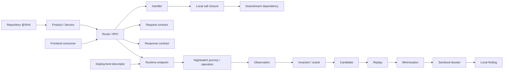
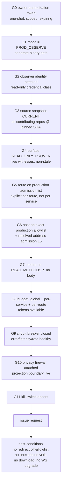
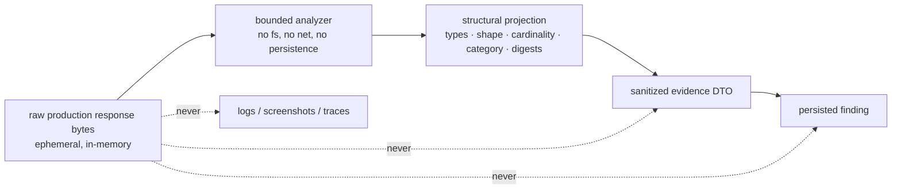
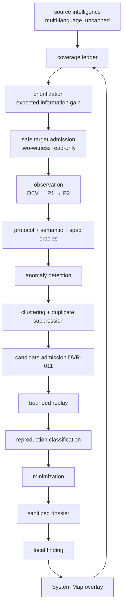

# Design — Production Observability & Whole-System Map

Target architecture for Nightwatch. Planning only; nothing here is authorized
for implementation. Every design element is justified against the audit
evidence in `audit.md`.

---

## 1. Problem

`audit.md` reduces Nightwatch's condition to four sentences:

1. The safety kernel is excellent and should not be redesigned.
2. Source reach is one repository, capped at 128 of 223 routes, with the cap
   silently unreported.
3. "Read-only proven" is membership in an 11-row hand-written catalog, so only
   5 of 128 operations qualify and only 3 surfaces are campaign-eligible.
4. Consequently the bug-hunting pipeline — which is itself sound — has produced
   zero product findings, and production, where the real defects are, is
   unreachable by construction.

Everything below follows from those four facts. The design deliberately **adds
reach and proof** and **adds one new execution mode**, while changing as little
of the proven safety core as possible.

---

## 2. The fact taxonomy — the invariant that governs everything else

Nightwatch already refuses to collapse "documented" into "proven". The target
system must extend that discipline to five categories that must never merge:

| Category | Definition | Authority | Decays when |
|---|---|---|---|
| `SOURCE_FACT` | Derived mechanically from repository content at an exact 40-hex SHA by a fixed bounded extractor, with an `ev:sha256:<24>` evidence digest | Extractor + repo@SHA | The repo SHA moves, or the normalized extraction digest changes |
| `DEPLOYMENT_FACT` | Derived mechanically from deployment descriptors (CI config, Ingress, service manifest) at an exact SHA | Deployment repo@SHA | The deployment descriptor changes |
| `RUNTIME_FACT` | Observed from a real response in a named environment at a named instant | The observation itself | Immediately — every runtime fact is timestamped and never re-asserted for a later instant |
| `OBSERVATION` | One bounded, projected, sanitized record of one exchange | Run identity | Never re-derived; retained per policy |
| `INFERENCE` | Anything computed by joining the above that is not itself mechanically proven | The joining rule | Whenever any input decays |

**Invariants.**

- `I-1` Every node and edge in the system model carries exactly one category
  plus its provenance tuple `(repoId, sha, path, extractorVersion,
  evidenceDigest)` or `(environment, observedAt, runId)`.
- `I-2` A join of two facts of different categories yields `INFERENCE`, never
  the stronger of the two.
- `I-3` No authority (campaign admission, replay, production admission) may be
  granted by an `INFERENCE`.
- `I-4` A category may never be upgraded in place; a stronger fact is a new
  fact with its own provenance, and the weaker one remains visible.
- `I-5` Absence of evidence is `UNKNOWN`, and `UNKNOWN` is never `SAFE`.

This is the generalization of the existing `SOURCE_STALE` / `NOT_APPLICABLE` /
`PARTIAL_COVERAGE` receipt discipline (D-55) to the whole system model.

---

## 3. Whole-system model

### 3.1 The chain to be represented



### 3.2 What is provable today vs what is missing

| Edge | Today | Target mechanism | Class after |
|---|---|---|---|
| Repository → Service | hand-written `RIPPLE_REPOSITORIES` | discovery over sibling root + `SERVICES.md` + `go.mod`/`composer.json`/`package.json` | `SOURCE_FACT` |
| Service → Route (PHP) | `parseYamlRoutes`, capped 128 | same parser, cap removed / paged | `SOURCE_FACT` |
| Service → RPC (proto) | **absent** | `.proto` lexer over `service`/`rpc`/`option (google.api.http)` | `SOURCE_FACT` |
| Proto service → Go service dir | **absent** | `pkg.RegisterXServer(gs, svc)` lexer over `ouchan/services/*/main.go` | `SOURCE_FACT` |
| Route → Handler | PHP `client`+`method` fields | unchanged | `SOURCE_FACT` |
| Handler → call closure | bounded response-flow v2, 13 attempts / 0 proven | extend to a **bounded effect closure** (§4) | `SOURCE_FACT` |
| Route → Response contract | 43 of 128 | proto message types give exact response schema for 662 RPCs | `SOURCE_FACT` |
| Frontend → Route | **absent** | Vue-SFC + TS analyzers over `axios` instance calls, joined by literal path | `SOURCE_FACT` (literal) / `INFERENCE` (template) |
| Route → Runtime endpoint | 11-row catalog | CI-trigger extraction (repo → `ouchan/services/<n>`) + host matrix from `ripple-ui/src/config/common.js`; final Ingress hop **UNKNOWN** (U-1) | `DEPLOYMENT_FACT` where available, else `UNKNOWN` |
| Route → Read-only | 11-row catalog | two-witness proof (§4) | `SOURCE_FACT` |
| Endpoint → Journey | hand-authored | generated from proven read-only + runtime-bound surfaces | `SOURCE_FACT` + `DEPLOYMENT_FACT` |

### 3.3 Storage

The model is a **content-addressed, append-only fact store**, not a mutable
graph. Each fact is `(factId = sha256(canonical(kind, subject, predicate,
object, provenance)), category, provenance, observedAt?)`. A rescan produces a
new snapshot; the diff between snapshots *is* change intelligence, replacing
the 21 hand-coded dependency edges. Rationale: the existing architecture
already treats every artifact as content-addressed and immutable; a mutable
graph would reintroduce the drift class of bug B-4.

---

## 4. Read-only proof — the central new capability

Today: `method === 'GET' ∧ in hand-catalog`. Target: **two independent
witnesses, both `SOURCE_FACT`, both fail-closed.**

### 4.1 Witness classes

| Witness | Applies to | Positive evidence | Fails closed on |
|---|---|---|---|
| `W-DECLARED_VERB` | proto RPC | `option (google.api.http) = { get: "…" }` (no `body:`) | any non-`get` binding; multiple bindings; missing option |
| `W-DECLARED_ROUTE` | PHP route | `"get:/path"` key | any other verb |
| `W-EFFECT_CLOSURE` | PHP handler | bounded call closure (depth ≤ N, all callees exactly resolved) contains **no** identifier in `WRITE_VOCABULARY` and **no** `rbac->checkIs*Write*` | any dynamic dispatch, unresolved callee, depth overflow, `eval`/variable-function, or one write-vocabulary hit |
| `W-EFFECT_RPC` | Go gRPC handler | handler method's bounded closure touches no Spanner/DynamoDB/BigQuery mutation API | same |
| `W-SPEC` | any | a `ripple-openspec` `Requirement:` that names the operation and asserts a read-only property | ambiguous or absent binding |

`WRITE_VOCABULARY` is a **data-only, versioned, owner-reviewed list**, seeded
from the measured Ripple DAO surface (`updateItem` 145, `deleteItem` 82,
`createItem` 72, `deleteHashData` 73, `insert*` ≈130). It is admitted the same
way expectation recipes are: fixed, bounded, digest-bound, never inferred.

### 4.2 Classification lattice

```
UNKNOWN ─────────────────────────────────────────────► never executable
   │
   ├─ one witness  ──► READ_ONLY_SINGLE_WITNESS ─────► DEV-executable only
   │
   └─ two witnesses ─► READ_ONLY_PROVEN ─────────────► candidate for PROD_OBSERVE
                              │
                              └─ + P1 passive corroboration ─► READ_ONLY_CORROBORATED
```

`MUTATION_CAPABLE` is terminal and never re-litigated. **A GET binding alone is
never sufficient for production**: the requirement "assume a GET route may
mutate state unless mechanically proven otherwise" is satisfied by demanding a
declared-verb witness **and** an effect-closure witness.

### 4.3 Why not runtime differential proof

Rejected: "call it twice and see if state changed" requires (a) a state oracle
Nightwatch is frozen out of (Phase 6 owner freeze), and (b) actually issuing
the request before proving it safe — a circular dependency. Runtime evidence
may only *corroborate* (raise `READ_ONLY_PROVEN` → `READ_ONLY_CORROBORATED`),
never *establish*.

---

## 5. `PROD_OBSERVE` — production observation architecture

### 5.1 Chosen shape and rejected alternatives

| Option | Verdict |
|---|---|
| **A** — add `production` to `SUPPORTED_ENVIRONMENTS` and a fourth allowlist file | **Rejected.** Reuses the DEV code path; one config mistake silently enables everything; destroys the fail-closed-by-construction property of D-4; makes "is this run production?" a runtime string comparison. |
| **B** — separate authorization class, separate mode, separate config, separate launcher, disjoint capability set | **CHOSEN.** |
| **C** — read-only replica / traffic mirror | **Rejected as primary.** No such replica exists; it would be a DEPLOYMENT_FACT Nightwatch cannot establish; and it does not test the real serving path. Retained as a future option if the organization ever provides one. |
| **D** — passive log/telemetry analysis only | **Rejected as sufficient, retained as P1.** It is exactly stage P1 below; it cannot exercise a route, so it cannot find route-level defects. |

Under **B**, `production` is still **not** a value of `NIGHTWATCH_ENV`. D-4
survives verbatim: `SUPPORTED_ENVIRONMENTS` stays `['local','dev','next']` and
`config/environments/production.json` stays structurally unloadable. Production
observation is a *different program* — `nightwatch-observe` — with its own
config namespace (`config/observation/prod.v1.json`), its own policy object
(`ProductionObservationPolicy`, not `OutboundPolicy` with a new branch), and its
own launcher that physically cannot execute a DEV/NEXT campaign.

Rationale: the strongest property Nightwatch has is *"a file that cannot be
loaded cannot be mis-selected"* (D-4 rationale). Option B preserves it by never
teaching the existing loader about production at all.

### 5.2 The admission chain

Every production request must pass **eleven** ordered gates. Any failure is
terminal for the campaign, not for the request.



`G0`–`G11` are all fail-closed; `UNKNOWN` at any gate is a failure. Unknown
operation classes hit `OWNER_POLICY_BLOCKED` before any executor callback, per
the existing owner-scope contract.

### 5.3 Defense in depth mapped to existing layers

| Concern | Mechanism | Reuses |
|---|---|---|
| Wrong host | exact production host allowlist + `KNOWN_PRODUCTION_HOSTS` inverted into an *allow* table only inside `PROD_OBSERVE` | `hosts.ts` tables, `OutboundPolicy` rule shape |
| DNS rebinding | complete-answer-set admission, global-unicast requirement, exact numeric dial | L5 `addressPolicy.ts` unchanged |
| Redirects | L0 CDP Fetch guard re-evaluates every follow-up against the production policy | unchanged |
| WebSockets | **denied outright** in `PROD_OBSERVE` v1 (stricter than DEV) | L2 |
| Service workers | blocked; any `serviceworker` event is fatal | L3 |
| Downloads | denied and cancelled; any download attempt is a safety event | D-19 |
| Background/telemetry | blocked-not-failed exactly as in DEV | D-5, D-29 |
| Browser escape | rootless L6 namespace mandatory for every production run (in DEV it is optional) | `l6.ts` |
| Process escape | `--unshare-net`, namespace-local relay, bounded 8-call relay budget | `l6.ts` |
| Mutation by accident | action policy passive-only **and** route-level `READ_ONLY_PROVEN` **and** method restriction — three independent guards | `actions.ts` + §4 + G7 |

### 5.4 Budgets, breakers, kill switch

| Control | v1 value (proposed, owner-tunable) | Enforcement |
|---|---|---|
| Global request budget per campaign | 200 | token bucket consumed at G8, checkpointed |
| Per-service budget | 50 | same |
| Per-route budget | 10 | same |
| Concurrency | 1 (serial) | launcher is serial by construction |
| Rate | ≤ 1 req / 2 s per service | pre-issue sleep, monotonic clock |
| Replay of a production observation | ≤ 2, and only of `READ_ONLY_PROVEN` routes | replay reservation ledger (existing) |
| Circuit breaker — errors | 3 consecutive 5xx on a service → open for the campaign | post-condition evaluator |
| Circuit breaker — latency | p95 above a pinned baseline × 3 → open | requires P1 baseline; until then, absolute ceiling |
| Circuit breaker — global | any 429, any 503 anywhere → open globally | immediate |
| Kill switch | presence of `$NIGHTWATCH_HOME/PROD_STOP` → next gate check fails; plus `hub`-independent single command | checked at G11 before every request |
| Safety event | any non-zero safety counter → campaign terminates, no further request | existing orchestrator path |

Budgets are **reserved before execution and never refunded**, matching the
existing replay-reservation ledger semantics so an interruption cannot
double-spend.

### 5.5 Promotion stages and hard gates

The prompt's P0–P4 ladder is retained but with two corrections: an explicit
**qualification stage before any contact**, and **corroboration** as a distinct
step so that runtime evidence never becomes the basis of a safety decision.

```mermaid
stateDiagram-v2
  [*] --> P0
  P0: P0 LOCAL PROOF — source, synthetic, offline
  P0 --> PQ: all P0 gates green
  PQ: PQ QUALIFICATION — full production admission chain replayed against a local mock production, zero real contact
  PQ --> P1: owner token + PQ receipt
  P1: P1 PASSIVE — observe the operator's own already-loaded production page; issue no request
  P1 --> P2: baselines captured, privacy audit clean
  P2: P2 BOUNDED ACTIVE READS — ≤N requests to READ_ONLY_PROVEN routes, serial, rate-limited
  P2 --> P3: 0 safety events over K campaigns
  P3: P3 BOUNDED REPLAY — replay only of independently proven reads, ≤2 per candidate
  P3 --> P4: reproduction fidelity proven
  P4: P4 AUTONOMOUS READ-ONLY CAMPAIGNS — scheduled, budgeted, unattended
  P2 --> P0: any safety event
  P3 --> P0: any safety event
  P4 --> P0: any safety event
```



Promotion gates (all must hold; each is a machine check, not a judgement):

| Transition | Gate |
|---|---|
| P0 → PQ | typecheck, hardening, full local + clean-Node20 gate, adversarial corpus, all quality floors zero |
| PQ → P1 | every G0–G11 gate exercised against a local mock production with 100 % denial of every non-admitted case; privacy sentinel suite green; kill switch proven to stop a running campaign within one gate check |
| P1 → P2 | ≥ 3 passive sessions, zero requests issued by Nightwatch, zero raw values persisted (proven by a persistence audit), latency/error baselines recorded |
| P2 → P3 | ≥ K = 5 campaigns, zero safety events, zero privacy events, zero budget overruns, zero circuit-breaker opens attributable to Nightwatch |
| P3 → P4 | replay reproduces ≥ 1 candidate deterministically with exact fingerprint equality; minimization bounded; dossier privacy-clean |
| any → P0 | one safety event, one privacy event, or one unexplained production error |

Each transition requires a **fresh, one-shot owner authorization**; none is
implied by the previous one.

### 5.6 Observer identity

`UNKNOWN` (U-3) whether an organizationally read-only production identity can
exist. The design therefore does **not** depend on it, but is structured to use
it when available:

- v1 assumes the observer credential has the same authority as a normal
  read-only user, and treats RBAC as **defence in depth, not a control**.
- The design records `observerIdentityClass ∈ {ORG_ENFORCED_READ_ONLY,
  ORDINARY_USER, UNKNOWN}` on every production run. `P4` requires
  `ORG_ENFORCED_READ_ONLY`; `P2`/`P3` may proceed with `ORDINARY_USER` because
  the eleven-gate chain and the two-witness read-only proof do not rely on it.
- Credentials remain external-only, path-referenced, never read for values —
  unchanged from D-13/D-20.

---

## 6. Privacy firewall

### 6.1 The change of kind

Today: a `RedactionLayer` scrubs known-sensitive headers, query params and
registered secret values **after** observation and **before** persistence
(D-6), plus `assertPrivatePayload` sentinel screening at the store boundary.
This is a **denylist**. It is adequate for DEV fixtures and demonstrably
sufficient for the fake-secret suites, but it is the wrong shape for production
customer data, where the sensitive material is *ordinary-looking business
values* — an account id, an invoice number, a cost figure, a company name.

Target: **allowlist structural projection**, enforced by a boundary raw bytes
cannot cross.



### 6.2 What may be persisted (closed allowlist)

`type` · `shape` (key set, nesting) · `cardinality` · `category` (enumerated
classifier output) · HTTP status class · invariant result · deterministic
digest (salted per-run so digests are not a cross-run join key on customer
identity) · sanitized structural difference · timestamps · route identity ·
source provenance · replay status · receipt outcome.

### 6.3 What may never be persisted (closed denylist, enforced twice)

names · emails · account identifiers · customer ids · invoice numbers ·
monetary amounts · arbitrary free text · raw rows · raw JSON · cookies ·
headers · tokens · secrets · full URLs containing query data · screenshots of
authenticated production pages · Playwright traces.

Enforced twice: (1) the projection layer can only *emit* allowlisted node
kinds — there is no code path that copies a leaf value; (2) the store boundary
re-screens and fails closed.

### 6.4 Production-specific rules

| Rule | Production | DEV (today) |
|---|---|---|
| Screenshots | **prohibited** | allowed, redacted |
| Playwright trace | **prohibited** (already always-off when authenticated) | off when authenticated |
| Response body retention | **zero bytes**, projection only | bounded, redacted |
| URL retention | route template only; concrete path params replaced by `{}` | redacted URL |
| Digest salt | per-campaign random, never persisted | n/a |
| Evidence expiry | 30 days default; unresolved findings owner-controlled | existing retention |
| Store | separate root `$HOME/.nightwatch/prod-findings/`, mode 0700/0600, never the DEV root | `$HOME/.nightwatch/findings/` |
| Publication | structurally impossible — no connector exists, `EXTERNAL_PUBLICATION` frozen | same |

### 6.5 Tests that must exist before P1

- **Sentinel corpus**: a synthetic production response containing every
  forbidden value class; assert that no byte of any sentinel appears anywhere
  under the private root, in any log, or in any error message, after a full
  campaign.
- **Projection totality**: property test asserting the projection of an
  arbitrary JSON document contains no string leaf from the input.
- **Boundary isolation**: hardening rule asserting the projection module
  imports no `fs`, `net`, `http`, `child_process`, and that the analyzer
  receives raw bytes only through one call-scoped reader.
- **Error-path leakage**: every thrown error in the analyzer/projection cone is
  asserted to be categorical (a code, never interpolated content).
- **Digest non-invertibility**: assert per-campaign salt is used and not
  persisted.

---

## 7. Control Center / System Map V2

### 7.1 Keep or rebuild

**Keep the backend. Rebuild the graph view only.** The server, its 14 versioned
contracts, its 5 authorities and its read-only enforcement are correct and
cheap to extend. What fails is exclusively the rendering layer: a fixed
3-column SVG grid capped at 24 nodes / 48 edges (`App.tsx`) against contracts
that permit 1,000 / 2,000, with no zoom, pan, search, filter, or drill-down, and
a truncation the operator cannot see.

### 7.2 Graph technology

| Option | Verdict |
|---|---|
| Extend handcrafted SVG | Rejected — will not survive 10³–10⁴ nodes; no hit-testing; layout is index arithmetic |
| D3-force | Rejected — non-deterministic layout breaks Nightwatch's determinism discipline |
| Cytoscape.js | Viable, heavy |
| **ELK.js (deterministic layered layout) + canvas/WebGL renderer, with SVG fallback below 200 nodes** | **CHOSEN** — layout is a pure function of the graph, so a snapshot is byte-reproducible; canvas scales to 10⁴ nodes |

Determinism is the deciding criterion: every other Nightwatch artifact is
content-addressed and byte-reproducible, and a system map whose layout changes
between runs cannot be diffed.

### 7.3 Progressive disclosure

Four zoom levels, each a distinct server-side projection with its own bounded
contract, so the browser never receives the whole graph:

`L1 Company` (products) → `L2 Product` (repos + services) →
`L3 Service` (routes/RPCs, grouped) → `L4 Operation` (handler, contracts,
downstream, frontend consumers, observations, findings).

### 7.4 Evidence status is the primary visual variable

Every node and edge renders its category and proof state, never a bare "OK":

`MECHANICALLY_PROVEN` · `RUNTIME_OBSERVED` · `PRODUCTION_OBSERVED` ·
`SOURCE_ONLY` · `PARTIAL` · `INFERRED` · `STALE` · `UNAVAILABLE` ·
`MUTATION_CAPABLE` · `READ_ONLY_PROVEN` · `REPLAY_PROVEN` · `FINDING_PRESENT` ·
`TRUNCATED`.

`TRUNCATED` is a first-class state, added specifically so bug B-1 becomes
impossible to hide: any projection that dropped rows must say so, with the
count and the limit that caused it.

### 7.5 Overlays and queries

Overlays: production · safety · findings · coverage · change/history · privacy.

The operator queries that must be answerable, each backed by a bounded
server-side projection:

- *Why is this unproven?* → ordered blocking-stage chain with reason codes
  (already computed as `firstBlockingStage`/`secondaryBlockingStages`; only the
  view is missing).
- *Show the path from this UI control to the backend handler.*
- *Show every surface touching this service.*
- *Show all observed production paths.*
- *Show all mutation-capable routes.*
- *Show untested read-only routes.* (today: 76)
- *Show coverage gaps.*
- *Show findings attached to topology.*

### 7.6 The UI must never become execution authority

Preserved absolutely: GET/HEAD only; `executionAuthority: NONE`;
`mutationAuthority: NONE`; no POST route exists to add one. Any future
"trigger" affordance is explicitly out of scope; if it is ever wanted it must
be a separate CLI, not a Control Center endpoint. The SSE stream may push
*state*; it may never accept *commands*.

---

## 8. Coverage model

One global percentage is prohibited. Two ledgers, each a vector of independent
dimensions, each with an explicit `UNKNOWN` bucket that is never folded into a
denominator.

### 8.1 System Coverage Ledger

| Dimension | Today (measured) |
|---|---|
| repositories discovered | 148 |
| repositories in universe | 6 |
| repositories analyzed | 6 |
| repositories producing operations | **1** |
| services discovered | 131 (catalog) — 0 modelled |
| routes/RPCs discovered | 128 of ≥ 885 known-declarable |
| routes truncated (unreported) | **95** |
| handler joins proven | 118 |
| request contracts proven | 127 |
| response contracts proven | 43 |
| read-only classifications proven | **5** |
| frontend↔backend joins proven | 0 |
| runtime bindings proven | 5 |
| independent expectation corpora used | 0 of ≈350 requirements |

### 8.2 Production Coverage Ledger

| Dimension | Today |
|---|---|
| production hosts admitted | 0 |
| production routes admitted | 0 |
| production paths passively observed | 0 |
| production paths actively read | 0 |
| replay-capable production surfaces | 0 |
| replay-proven production surfaces | 0 |
| production findings | 0 |
| production safety events | 0 |
| production privacy events | 0 |
| stale production admissions | 0 |

### 8.3 Rules

- Every dimension reports `{proven, unproven, unsupported, truncated, unknown}`
  — five buckets, never three.
- `truncated > 0` invalidates any completeness claim for that dimension.
- Coverage is reported **per repository and per language**, because an
  aggregate hides the fact that five of six repositories contribute nothing.
- A dimension with no measurement is `UNMEASURED`, never `0 %`.

---

## 9. Bug-hunting pipeline

### 9.1 Target loop



### 9.2 Prioritization by expected information gain

Score each admissible surface:

```
EIG = novelty × contract_depth × change_recency × blast_radius
      ÷ (cost + duplicate_risk)
```

- `novelty` — never observed > observed-but-no-oracle > observed-with-oracle.
- `contract_depth` — `TYPE`/`COLLECTION` expectations beat `SHAPE` beat
  protocol-only.
- `change_recency` — from the source-snapshot diff (this finally gives the
  orphaned change-intelligence layer a consumer, closing A.10 item 4).
- `blast_radius` — count of frontend consumers and downstream services from the
  system model.
- `cost` — budget units.
- `duplicate_risk` — prior fingerprints in the same cluster.

Explicitly **not** maximizing request volume: `cost` in the denominator and
per-route budget caps make a broad shallow sweep score worse than a deep pass
over new contracts.

### 9.3 Yield failure modes to fix (measured, from §A.7)

| Failure | Cause | Fix |
|---|---|---|
| `REPLAY_SOURCE_FRESHNESS_UNCONFIRMED` | candidate's source binding could not be confirmed current at replay time | make the source snapshot a campaign-frozen input, so freshness is decided once at prepare, not re-derived at replay |
| replay starvation at `journeyContexts 3/3` | collection consumed the shared browser budget | already repaired at `6b13744`; keep the protected reserve |
| candidate starvation | 3 eligible surfaces | §4 + §3 raise eligibility; this is the real fix |
| protocol-only candidates | no semantic expectation on the observed surface | proto-derived response contracts + spec-derived expectations |

### 9.4 Stale source, drift, and new deployments

- A campaign freezes a source snapshot digest. Any repo SHA change invalidates
  dependent authority for the *next* campaign, never mid-campaign.
- **Source/runtime drift detection**: when a `RUNTIME_FACT` contradicts a
  `SOURCE_FACT` (e.g. an observed response key absent from the proven contract),
  that is itself a first-class finding class `SOURCE_RUNTIME_DRIFT` — it is
  either a deploy skew or a genuine bug, and both are worth reporting.
- **New-deployment detection**: a change in the response of a fixed
  `READ_ONLY_PROVEN` probe's structural digest, with no corresponding source
  change, indicates a deployment; it re-arms `change_recency` for that service.
- **Cross-version comparison**: DEV vs NEXT vs PROD structural projections of
  the same route are directly comparable because projections contain no values.
  A shape divergence across environments is a high-value, low-risk finding
  class.

---

## 10. What is deliberately NOT designed here

- Any write, mutation, sandbox-MSP mutation, or dry-run mutation in any
  environment. D-4's "writes to production data" prohibition is untouched and
  the plan proposes no future path to it.
- Any infrastructure, Kubernetes, cloud-console, IAM, or datastore operation.
  The owner freeze (D-29) stands; the design routes around it by using
  deployment *descriptors in source* rather than live infrastructure APIs, and
  accepts U-1 as an open unknown rather than proposing to resolve it by
  querying a cluster.
- Any AI decision authority. `EFFECTIVE_NEXT_PROMOTION_AUTHORITY: NONE` and
  D-32 ("deterministic evidence outranks AI") are preserved. AI remains a
  review assistant over already-sanitized evidence.
- Any external publication. No connector, no issue creation, no Slack.
- Any Control Center execution affordance.
